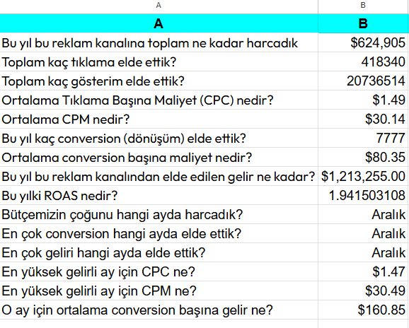

# 🎬 Netflix Reklam Kampanya Analizi I
## Instagram Ads Performance Report

> A data analytics project focused on evaluating Instagram advertising performance throughout 2025 using real-world daily campaign data.

---

## 📌 Project Overview

This project analyzes a full year of Instagram advertising performance data to understand how advertising spend translates into impressions, clicks, conversions, and revenue.

The dataset contains 365 daily records covering the period from January 1, 2025 to December 31, 2025.

The analysis transforms raw advertising data into meaningful marketing performance metrics and business insights.

---

## 🎯 Business Objective

The main objective is to evaluate advertising efficiency and identify the periods where the advertising budget generated the strongest results.

The analysis answers questions such as:

- How much was spent on advertising throughout the year?
- How many impressions and clicks were generated?
- How many conversions were achieved?
- How much revenue was generated?
- What was the average CPC and CPM?
- What was the overall ROAS?
- Which month generated the highest revenue?
- Which month generated the most conversions?
- Which month received the highest advertising spend?
- How efficient was the highest-revenue month?

---

## 📊 Dataset

The dataset contains daily Instagram advertising performance data with the following fields:

| Column | Description |
|---|---|
| Date | Date of the advertising activity |
| Impressions | Number of times the advertisement was displayed |
| Clicks | Number of clicks |
| Spending ($) | Daily advertising spend |
| Conversions | Number of completed target actions |
| Revenue ($) | Revenue generated from conversions |

The dataset contains **365 records covering the full 2025 calendar year**.

---

## 🧹 Data Preparation

Before analysis, the raw data was reviewed and prepared for analysis.

Key preparation steps included:

- Importing the advertising dataset into Google Sheets
- Checking the structure and completeness of the data
- Converting date values into usable date formats when necessary
- Cleaning currency values when required
- Checking for missing values and data consistency

The dataset was verified to contain 365 daily records with no missing cells.

---

## 📈 Key Performance Indicators

The project calculates the following digital advertising KPIs:

### CTR — Click-Through Rate

Measures the percentage of impressions that resulted in clicks.

`CTR = Clicks / Impressions`

### Conversion Rate

Measures the percentage of clicks that resulted in conversions.

`Conversion Rate = Conversions / Clicks`

### CPM — Cost per Mille

Measures advertising cost per 1,000 impressions.

`CPM = Spending / Impressions × 1,000`

### CPC — Cost per Click

Measures the average cost of each click.

`CPC = Spending / Clicks`

### Average Conversion Value

Measures the average revenue generated per conversion.

`Average Conversion Value = Revenue / Conversions`

### ROAS — Return on Ad Spend

Measures revenue generated for every dollar spent on advertising.

`ROAS = Revenue / Spending`

---

## 📊 Annual Performance Summary
### Annual Performance Summary


The 2025 advertising performance was summarized using aggregated campaign data.

| Metric | Result |
|---|---:|
| Total Spending | $624,905 |
| Total Impressions | 20,736,514 |
| Total Clicks | 418,340 |
| Total Conversions | 7,777 |
| Total Revenue | $1,213,255 |
| Average CPC | $1.49 |
| Average CPM | $30.14 |
| Average Conversion Cost | $80.35 |
| ROAS | 1.94x |

---

## 📅 Monthly Performance Analysis
### Monthly Performance Overview


The advertising data was also analyzed at monthly level to compare campaign performance throughout the year.

The monthly analysis includes:

- Spending
- Clicks
- Conversions
- Revenue
- CPC
- CPM
- ROAS

### Best-Performing Month by Scale

**December** generated the highest:

- Advertising spend: **$69,955**
- Clicks: **47,640**
- Conversions: **830**
- Revenue: **$133,509**

December's performance metrics were:

| Metric | December |
|---|---:|
| Spending | $69,955 |
| Clicks | 47,640 |
| Conversions | 830 |
| Revenue | $133,509 |
| CPC | $1.47 |
| CPM | $30.49 |
| ROAS | 1.91x |

---

## 💡 Key Business Insights

### 1. December generated the highest revenue

December produced **$133,509 in revenue**, making it the highest-revenue month in the dataset.

### 2. December also had the highest conversion volume

With **830 conversions**, December generated the highest number of conversions during the year.

### 3. Higher spending did not necessarily mean higher efficiency

Although December generated the highest revenue, its **1.91x ROAS** was below the **2.07x ROAS** achieved in both October and November.

This shows that campaign scale and campaign efficiency should be evaluated separately.

### 4. October and November were highly efficient months

Both October and November achieved approximately **2.07x ROAS**, indicating stronger advertising efficiency compared with December.

### 5. Budget allocation should consider both scale and efficiency

The results suggest that the month generating the most revenue is not necessarily the month with the highest return on advertising spend.

A future budget allocation strategy should therefore consider both:

- Revenue growth
- Advertising efficiency

---

## 🛠️ Tools & Techniques

### Tools

- Google Sheets
- Pivot Tables
- Data Visualization

### Spreadsheet Functions & Techniques

- DATEVALUE
- SUBSTITUTE
- Basic arithmetic formulas
- Pivot Tables
- Date grouping
- KPI calculations
- Monthly aggregation

---

## 📋 Project Workflow

```text
Raw Advertising Data
        ↓
Data Import
        ↓
Data Understanding & Cleaning
        ↓
Daily KPI Calculation
        ↓
Annual Performance Summary
        ↓
Monthly Performance Analysis
        ↓
Business Insights
